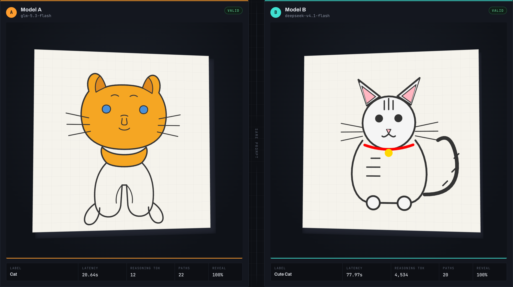
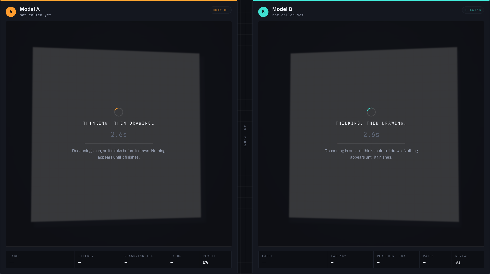
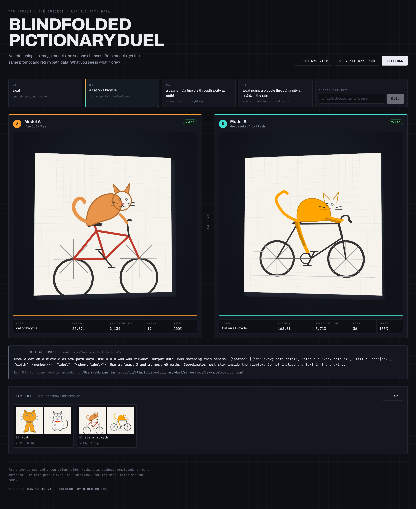
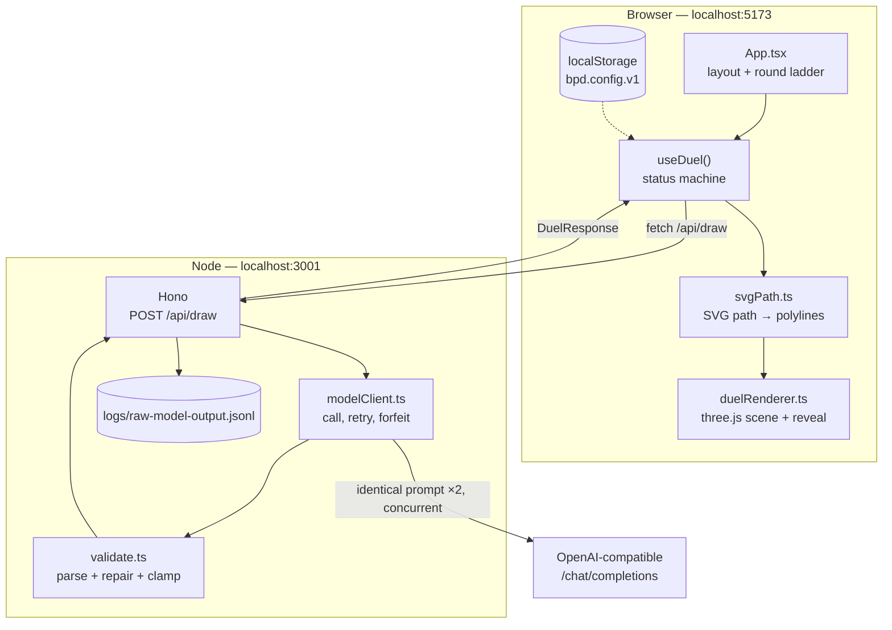
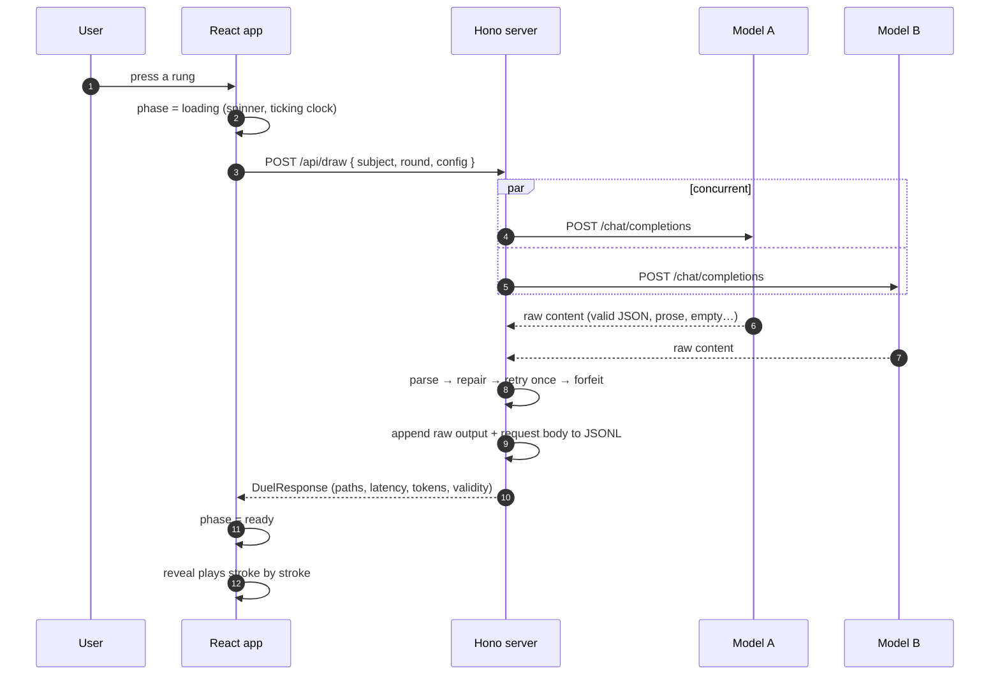

<div align="center">

# Blindfolded Pictionary Duel

**Two language models are asked to draw the same thing using nothing but raw SVG path data.
Their drawings are rendered live, side by side, with no human retouching.**

[](https://www.typescriptlang.org/)
[](https://react.dev/)
[](https://threejs.org/)
[](https://hono.dev/)
[](https://pnpm.io/)
[](LICENSE)

</div>

---

A model can bluff its way through prose. It cannot bluff its way through a picture.

Ask two models for "a cat" and you get two cats. Ask for "a cat riding a bicycle through a
city at night" and the drawings get denser, stranger, and more revealing. The prompt escalates
across rounds, the drawings reveal themselves stroke by stroke, and a filmstrip keeps every
round so you can watch the escalation in a single frame.

There is no image model here, no diffusion, no vector database, no retouching. A chat model is
asked for SVG path data as strict JSON, and whatever comes back is parsed, validated, and drawn
on a canvas. If it cheats, you see it cheat.

<p align="center">
  
</p>

<details>
<summary><strong>More screenshots</strong> — the working state and the full page with the filmstrip</summary>

<p align="center">
  
  <em>Reasoning models can take two minutes before they emit a single path, so the seat says so.</em>
</p>

<p align="center">
  
</p>

</details>

---

## Table of contents

- [What this is](#what-this-is)
- [Quick start](#quick-start)
- [Tech stack](#tech-stack)
- [Architecture](#architecture)
- [How it works](#how-it-works)
  - [1. One prompt, byte-identical](#1-one-prompt-byte-identical)
  - [2. Parsing defensively](#2-parsing-defensively)
  - [3. Retry, then forfeit](#3-retry-then-forfeit)
  - [4. Reasoning and the `max_tokens` trap](#4-reasoning-and-the-max_tokens-trap)
  - [5. Rendering: path data to three.js](#5-rendering-path-data-to-threejs)
  - [6. The working state](#6-the-working-state)
- [Verification](#verification)
- [Configuration](#configuration)
- [Round ladder](#round-ladder)
- [Project structure](#project-structure)
- [Fork and contribute](#fork-and-contribute)
- [Feature ideas](#feature-ideas)
- [License](#license)

---

## What this is

A single-page app that turns two chat models into two illustrators and puts them side by side.

1. You press a rung on a ladder — *a cat*, *a cat on a bicycle*, *a cat riding a bicycle
   through a city at night* — or type your own subject.
2. The server sends **one identical prompt** to both models concurrently.
3. Each model returns JSON containing an array of SVG paths.
4. The server validates every path, repairs what it can, retries once, and forfeits if it still
   cannot be drawn.
5. The client parses the path data into polylines and paints them onto a canvas, which becomes a
   texture on a subtly tilted three.js plane with a soft cast shadow.
6. The drawing reveals itself **stroke by stroke**, with a glowing pen head riding the tip of
   the current line.
7. Every round is kept in a filmstrip, and every raw model response is appended to a JSONL log
   on disk for audit.

The whole thing runs on your own provider. Paste a base URL, an API key, and two model names
into the in-app Settings panel. **There is no `.env` file, no `.env.example`, and no API-key
environment variable anywhere in this project.**

---

## Quick start

Requires **Node 20+** and **pnpm 11+**.

```bash
git clone https://github.com/harishkotra/blindfolded-pictionary-duel.git
cd blindfolded-pictionary-duel
pnpm install
pnpm dev
```

- Web: <http://localhost:5173>
- API: <http://localhost:3001> (Vite proxies `/api` to it)

The Settings panel opens on first load because no provider is configured. Paste a base URL, a
key, and two model names, then press a rung. The config is stored in your browser's
`localStorage` and sent to your local server with each request.

If another project already owns 5173 or 3001:

```bash
BPD_API_PORT=3101 BPD_WEB_PORT=5201 PORT=3101 pnpm dev
```

### Commands

| Command | What it does |
|---|---|
| `pnpm dev` | Runs the Hono API and the Vite dev server together |
| `pnpm typecheck` | Strict `tsc` over both workspaces |
| `pnpm test` | 17 unit tests for the parser and validator |
| `pnpm build` | Type-checks and builds the production bundle |
| `pnpm verify` | Browser-driven end-to-end verification against live models |

---

## Tech stack

| Layer | Choice | Why |
|---|---|---|
| Monorepo | **pnpm workspaces** | Strict `node_modules` catches undeclared dependencies that npm's hoisting hides |
| API | **Hono** on `@hono/node-server` | Tiny, fast, web-standard `Request`/`Response` |
| Server language | **TypeScript** via `tsx` | No build step in dev, no `ts-node` config |
| Frontend | **React 19 + Vite 8** | Fast HMR; React 19's `useMemo`/`useCallback` are enough state management here |
| 3D | **three.js** | A `CanvasTexture` on a `PlaneGeometry` with `OrbitControls` |
| Path parsing | **Hand-written** | The reveal needs per-point positions, so the DOM's `getPointAtLength` is not usable |
| Validation | **Hand-written** | Needs to survive fences, prose, truncation and typo'd keys |
| Verification | **Playwright** | Drives the real UI, so it runs on whatever provider the app is configured with |

There is no database, no auth, no state on the server, and no SDK. The provider call is a plain
`fetch` to an OpenAI-compatible `/chat/completions`.

---

## Architecture

Three pnpm workspaces. `shared` is the single source of truth for the wire contract, the prompt,
and the round ladder, so the client and server cannot drift apart.



### Request lifecycle



The two calls are concurrent (`Promise.all`), so a duel takes as long as the slower model, not
the sum.

---

## How it works

### 1. One prompt, byte-identical

Both seats are built from the same `buildUserPrompt(subject)` call, and the response echoes the
exact prompt string plus each model's full request body — so "identical prompt" is *auditable*
rather than asserted.

```ts
// shared/src/index.ts
export const SYSTEM_PROMPT =
  'You are a vector illustrator. You output only valid JSON. You never output prose, markdown, or commentary.';

export function buildUserPrompt(subject: string): string {
  return (
    `Draw ${subject} as SVG path data. Use a 0 0 400 400 viewBox. ` +
    'Output ONLY JSON matching this schema: ' +
    '{"paths": [{"d": "<svg path data>", "stroke": "<hex colour>", "fill": "none|hex", "width": <number>}], "label": "<short label>"}. ' +
    'Use at least 3 and at most 40 paths. Coordinates must stay inside the viewBox. ' +
    'Do not include any text in the drawing.'
  );
}
```

The server also sends `response_format: { type: 'json_object' }`, which most OpenAI-compatible
providers honour.

### 2. Parsing defensively

Models leak markdown fences, wrap JSON in prose, truncate mid-object, and — measured, not
imagined — **typo the key itself** while getting the value perfectly right. All of it is handled
in `server/src/validate.ts`:

1. Strip code fences (```` ```json ````, bare ```` ``` ````, and unterminated ones).
2. Find the outermost balanced JSON object with a depth counter that is **string- and
   escape-aware**, so a `}` inside a string literal never ends the scan early.
3. Validate that every `d` starts with a real SVG path command, contains only legal path
   characters, and actually carries coordinates.
4. Clamp out-of-viewBox coordinates (relative commands clamp to `-400..400`, since their numbers
   are deltas).
5. Drop unusable paths, cap the count at 40, and default bad colours and widths.

```ts
// server/src/validate.ts — brace matching that respects string literals
export function findOutermostObject(text: string): string | null {
  const start = text.indexOf('{');
  if (start === -1) return null;
  let depth = 0;
  let inString = false;
  let escaped = false;
  for (let i = start; i < text.length; i++) {
    const ch = text[i]!;
    if (escaped) { escaped = false; continue; }
    if (ch === '\\') { if (inString) escaped = true; continue; }
    if (ch === '"') { inString = !inString; continue; }
    if (inString) continue;
    if (ch === '{') depth++;
    else if (ch === '}') {
      depth--;
      if (depth === 0) return text.slice(start, i + 1);
    }
  }
  return null;
}
```

The malformed-key recovery is worth calling out, because it was found in real output. Both
models occasionally emit `{"d: ": "M140 320 …"}` — correct value, typo'd key. Dropping that entry
would silently delete a real stroke from the drawing, so the parser looks for a plausible key
first, and falls back to any string value shaped like path data:

```ts
// server/src/validate.ts
const PATH_KEY_CANDIDATES = ['d', 'd:', 'd: ', 'path', 'pathData', 'data', 'svg', 'points'];

function recoverPathData(entry: Record<string, unknown>): string | null {
  if (typeof entry.d === 'string') return entry.d;

  for (const [key, value] of Object.entries(entry)) {
    if (typeof value !== 'string') continue;
    const normalised = key.trim().toLowerCase().replace(/[^a-z]/g, '');
    if (PATH_KEY_CANDIDATES.includes(normalised)) return value;
  }

  // Last resort: any string value that looks like path data.
  for (const value of Object.values(entry)) {
    if (typeof value === 'string' && /^[Mm][\s\d.,-]/.test(value.trim())) return value;
  }
  return null;
}
```

Repairs are recorded and surfaced in the UI as a **repaired** badge with the reason. Anything
that leaves fewer than three usable paths is a hard failure.

### 3. Retry, then forfeit

Each model gets exactly one retry. A second failure is recorded as a **forfeit**: the duel still
renders, the other seat is unaffected, and the provider's real error text is shown verbatim.

```ts
// server/src/modelClient.ts — retry policy, abridged
for (let i = 0; i < 2; i++) {
  const { attempt, requestBody: body } = await callOnce(model, subject, config, maxTokens);
  attempts.push(attempt);

  if (attempt.transportError) { lastReason = attempt.transportError; continue; }
  if (attempt.errorText) {
    lastReason = `HTTP ${attempt.status}: ${attempt.errorText}`;
    if (isFatalStatus(attempt.status)) break;  // 4xx except 408/429: do not retry
    continue;
  }
  if (!attempt.content.trim()) {
    lastReason = attempt.finishReason === 'length'
      ? `empty content: the model spent its entire ${maxTokens}-token budget on reasoning`
      : 'empty content';
    maxTokens = escalateBudget(maxTokens);
    continue;
  }
  // …parseDrawing() and return
}
```

`reasoning_content` is typed as `unknown` and **never read, logged, stored, or rendered**. Only
its token count is reported, from `usage.completion_tokens_details.reasoning_tokens`.

### 4. Reasoning and the `max_tokens` trap

This is the least obvious thing in the project and it cost a whole model its output before it
was understood.

`max_tokens` pays for the model's **thinking as well as its answer**. A thinking model that runs
out mid-thought returns *no content at all* — not a truncated drawing, nothing. Measured against
a real provider with `deepseek-v4.1-flash`:

| `max_tokens` | result |
|---|---|
| 1,600 | all 1,600 spent on reasoning, **0 paths** |
| 4,000 | all 4,000 spent on reasoning, **0 paths** |
| 8,192 | all 8,192 spent on reasoning, **0 paths** (city scene) |
| 16,384 | ✅ 8,350 reasoning tokens, then 23 paths |

So with reasoning enabled the server treats your Max Tokens as a **floor**:

```ts
// shared/src/index.ts
export const REASONING_MIN_BUDGET = 16384;

// server/src/modelClient.ts
function startingBudget(config: DuelConfig): number {
  return config.disableReasoning
    ? config.maxTokens
    : Math.max(config.maxTokens, REASONING_MIN_BUDGET);
}

function escalateBudget(current: number): number {
  return Math.max(current * 2, REASONING_MIN_BUDGET);
}
```

Below that floor a reasoning model cannot produce a drawing *by construction*, so honouring a
small number literally would only guarantee a wasted call. The value actually sent is recorded
in every logged request body, so it is auditable rather than assumed, and the Settings panel
says so when your budget is under the floor.

The "Disable reasoning" toggle sends `chat_template_kwargs: {"enable_thinking": false}`.

### 5. Rendering: path data to three.js

`web/src/lib/svgPath.ts` is a small SVG path parser supporting
`M m L l H h V v C c S s Q q T t A a Z z`, flattening curves into polylines. It does not use the
DOM, because the reveal animation needs per-point positions to drive the pen head. The arc
implementation does the full endpoint → centre parameterisation.

`web/src/lib/duelRenderer.ts` paints those polylines into a 1024² canvas, maps it to a
`CanvasTexture` on a subtly tilted `PlaneGeometry`, and adds a blurred offset copy as a soft
shadow. Each seat tilts the opposite way; `OrbitControls` is enabled with a straight-on default
camera.

The reveal is **append-only**: each frame paints only the newly travelled distance, so 40 paths
cost about as much as 3. A glowing pen head rides the tip of the current stroke.

The subtle bug worth documenting is that a naive implementation stalls forever:

```ts
// web/src/lib/duelRenderer.ts — DrawState
interface DrawState {
  strokeIndex: number;
  segIndex: number;
  segT: number;
  /**
   * Distance already travelled INTO the current segment.
   * Without this, a segment longer than one frame's travel would restart from
   * its beginning every frame and the reveal would stall forever.
   */
  segOffset: number;
}
```

With a fixed 60fps step, a segment longer than one frame's travel never completes: the partial
branch redraws from the segment start every frame and the progress counter freezes. The fix is
to accumulate sub-segment progress. The reveal duration also scales with density
(`revealSeconds(pathCount)`), because a 40-path cityscape flashing past in the same 3.4s as a
12-path cat wastes the payoff after a two-minute wait.

A **plain SVG view** renders the same path data without WebGL — useful on machines without a
GPU, and the honest way to show the canvas is nothing more than the model's own coordinates.

### 6. The working state

A reasoning model can take two minutes to emit its first path. The seat has to show that it is
alive, so it renders a spinner, a ticking clock, an indeterminate sweep, and a line explaining
the wait — and the status pill reads `drawing` in the seat's accent colour rather than `idle`.

```tsx
// web/src/components/DuelCanvas.tsx
useEffect(() => {
  if (phase !== 'loading') { setElapsed(0); return; }
  const started = Date.now();
  setElapsed(0);
  const id = window.setInterval(() => setElapsed((Date.now() - started) / 1000), 100);
  return () => window.clearInterval(id);
}, [phase]);
```

---

## Verification

```bash
pnpm test      # 17 unit tests for the parser and validator
pnpm verify    # live end-to-end checks against real models
```

`pnpm verify` needs `pnpm dev` running. It drives the real app in a real browser and runs on
**whatever provider the app is configured with** — it reads the same `bpd.config.v1` entry the
Settings panel writes, and there is nothing to mock, because every drawing it inspects came from
a live call. On the first run it opens a visible browser window and waits for you to fill in the
Settings panel once; the profile is kept in `.bpd-browser/` (gitignored) so later runs are
unattended:

```bash
pnpm verify -- --headless
pnpm verify -- --app-url=http://localhost:5201/   # if you moved the web port
```

It restores your settings afterwards, and a signal handler puts them back even if you Ctrl-C it
mid-run.

### Results

Numbers depend heavily on whether reasoning is on, so both modes are given. Figures are means
over every usable duel in `server/logs/raw-model-output.jsonl`.

**Reasoning off** — `deepseek-v4-flash-0731` vs `deepseek-v4.1-flash`:

| | Round 1 ("a cat") | Round 3 ("…city at night") |
|---|---|---|
| Model A paths | mean 19.0, range 14–33 | mean 38.5, range 7–40 |
| Model B paths | mean 19.6, range 14–33 | mean 39.0, range 36–40 |
| Latency | 4–27s | 9–19s |

```
28/28 checks passed
```

**Reasoning on** — `glm-5.3-flash` vs `deepseek-v4.1-flash`:

| | Round 1 ("a cat") | Round 3 ("…city at night") |
|---|---|---|
| Model A paths | mean 20.6, range 11–26 | mean 23.0, range 19–28 |
| Model B paths | mean 24.6, range 20–35 | mean 24.0, range 20–27 |
| Latency | 6–131s | 30–142s |

```
27/27 checks passed
```

### Honest caveats

All of these are visible in the raw log rather than swept up:

- **Escalation is a reasoning-off property.** With reasoning off, path counts roughly double
  from Round 1 to Round 3 (19.0/19.6 → 38.5/39.0). With reasoning on they barely move
  (20.6/24.6 → 23.0/24.0), and individual pairs invert. Thinking models plan the scene and draw
  it economically instead of padding toward the 40-path cap. The suite asserts escalation only
  in reasoning-off runs and prints a note otherwise, rather than claiming a pass for something
  untrue.
- **Model output is variable.** Across 22 logged Round 3 duels, path counts sat at 36–40 with
  two exceptions: one forfeit, and one run where Model A returned a 743-byte reply with 8 paths
  instead of ~3,800 bytes with 40. That is the model, not the pipeline — the app rendered the 7
  valid paths, dropped the 1 malformed one, and badged it `repaired`.
- **A single duel is a noisy sample.** An early version of the suite asserted on one duel per
  rung and flaked, because two models drawing "a cat" sometimes land on a similar layout. It now
  samples several duels and asserts on the aggregate.
- **Do not read a trend into the ink distance.** It only asserts that the drawings differ, at
  both rungs, well above the threshold. One run measured 18.4% → 42.8%, another 51.1% → 32.8%.
  The two models converge or diverge at each rung depending on the sample.

### What the suite asserts

1. Drawings are real model output parsed as JSON — nothing hand-authored or templated.
2. A broken model forfeits without crashing the duel or the other seat, and the provider's real
   error text is shown verbatim.
3. Both models receive a byte-identical prompt, system prompt, and parameters (compared by hash
   of the echoed request bodies).
4. Reasoning tokens come from the provider's usage block, and `reasoning_content` appears in
   neither the API response nor the log.
5. The two models' drawings are visibly different at both rungs, measured as ink-mask distance
   over the pixels actually painted on the canvas.
6. Config comes from the app's own `localStorage`, and no `.env` file or AI-related environment
   variable exists anywhere in the project.
7. No API key is hardcoded — the suite scans every source file for secret-shaped strings.
8. With reasoning on, a too-small budget is raised rather than wasted, confirmed from the
   `max_tokens` in the request body actually sent.

### Auditing a drawing against its source

Every duel appends the raw assistant content, the exact prompt, and the full request body to
`server/logs/raw-model-output.jsonl`. The in-app **Copy all raw JSON** button copies the same
material for the current session, and the plain SVG view shows each model's raw output next to
its rendered paths.

---

## Configuration

| Setting | Default |
|---|---|
| Base URL | `https://api.particle.ai/v1` |
| API Key | *(none — you paste it)* |
| Model A (older) | `deepseek-v4-flash-0731` |
| Model B (newer) | `deepseek-v4.1-flash` |
| Temperature | `0` |
| Max Tokens | `1600`, raised to `16384` when reasoning is on |
| Disable reasoning | on |

All persisted to `localStorage`. Any OpenAI-compatible `/chat/completions` endpoint works.
There is no server-side config, no `.env`, and no default key — the app cannot call anything
until you fill the panel in.

---

## Round ladder

| Round | Subject | What it adds |
|---|---|---|
| 1 | a cat | one object, no scene |
| 2 | a cat on a bicycle | two objects, contact point |
| 3 | a cat riding a bicycle through a city at night | scene, depth, lighting |
| 4 | a cat riding a bicycle through a city at night, in the rain | scene + weather + occlusion |

Plus a custom subject field for anything else.

---

## Project structure

```
.
├── shared/                  # wire contract, prompt, round ladder — one source of truth
│   └── src/index.ts
├── server/
│   ├── src/
│   │   ├── index.ts         # Hono app, CORS, /api/draw, JSONL logging
│   │   ├── modelClient.ts   # provider call, retry policy, forfeit
│   │   └── validate.ts      # fence stripping, brace matching, repair, clamping
│   └── test/validate.test.ts
├── web/
│   ├── src/
│   │   ├── App.tsx          # layout, round ladder, prompt box, filmstrip
│   │   ├── components/
│   │   │   ├── DuelCanvas.tsx    # one seat: three.js mount, loading, stats
│   │   │   ├── Filmstrip.tsx     # per-round history with paired thumbnails
│   │   │   ├── SettingsPanel.tsx # the only place config is entered
│   │   │   └── SvgFallback.tsx   # no-WebGL view of the same path data
│   │   ├── lib/
│   │   │   ├── duelRenderer.ts   # three.js scene, incremental reveal, pen head
│   │   │   ├── svgPath.ts        # SVG path → polylines, no DOM
│   │   │   ├── useDuel.ts        # status machine, history, copy-all-raw-JSON
│   │   │   └── storage.ts        # localStorage load/save
│   │   └── styles.css            # the whole design system
│   └── public/favicon.svg
├── scripts/verify.mjs       # browser-driven end-to-end verification
└── docs/                    # screenshots, blog post, launch copy
```

---

## Fork and contribute

MIT licensed. Forks, issues and PRs are all welcome.

### Getting set up

```bash
git clone https://github.com/harishkotra/blindfolded-pictionary-duel.git
cd blindfolded-pictionary-duel
pnpm install
pnpm typecheck && pnpm test && pnpm build
pnpm dev
```

Two things to know before you start:

- **`server` and `web` both declare `@bpd/shared` as `workspace:*`.** pnpm's isolated
  `node_modules` will not resolve it otherwise. If you add a workspace, declare its dependencies
  explicitly.
- **`pnpm verify` needs a real provider.** It has no mocks by design: it drives the real UI and
  reads whatever the app is configured with. If you are changing the request or validation path,
  run it — the unit tests only cover the pure functions.

### Where to make a change

| You want to change… | Edit |
|---|---|
| The prompt sent to both models | `buildUserPrompt` in `shared/src/index.ts` |
| What counts as a valid path | `server/src/validate.ts` + `server/test/validate.test.ts` |
| Retry/forfeit behaviour | `server/src/modelClient.ts` |
| The round ladder | `ROUND_LADDER` in `shared/src/index.ts` |
| How drawings are drawn | `web/src/lib/duelRenderer.ts` |
| How path data is parsed | `web/src/lib/svgPath.ts` |
| The look | `web/src/styles.css` (tokens at the top) |
| What the suite checks | `scripts/verify.mjs` |

### Adding a new provider

Any OpenAI-compatible endpoint already works — paste its base URL and key into Settings. If a
provider needs different request fields, that is a change in one place:

```ts
// server/src/modelClient.ts
export function buildRequestBody(model, subject, config, maxTokens) {
  return {
    model,
    max_tokens: maxTokens,
    temperature: config.temperature,
    messages: [
      { role: 'system', content: SYSTEM_PROMPT },
      { role: 'user', content: buildUserPrompt(subject) },
    ],
    response_format: { type: 'json_object' },
    ...(config.disableReasoning ? { chat_template_kwargs: { enable_thinking: false } } : {}),
  };
}
```

### Adding a unit test

The validator tests are pure functions with no network. Follow the existing shape:

```ts
test('recovers path data from a malformed key', () => {
  const out = parseDrawing(
    wrap([{ 'd: ': 'M0 0 L10 10', stroke: '#333', fill: 'none', width: 2 }]),
  );
  assert.equal(out.ok, true);
  assert.equal(out.drawing.paths.length, 1);
});
```

### Ground rules

- No mocks in the verification path. If it does not hit a real model, it is a unit test.
- No secrets in the repo. `pnpm verify` scans every source file for secret-shaped strings and
  will fail the build if you commit one.
- Keep the drawing the star. Effects that compete with the drawing are out of scope.
- If you change behaviour, change the README's numbers. Several claims in this file were
  corrected by measurement, and that is the point.

---

## Feature ideas

Roughly in order of how much they would add per unit of effort.

**Small, high value**

- **Streaming reveal.** Stream tokens from the provider and parse complete path objects as they
  arrive, so the drawing starts before the response finishes. The reveal already works
  incrementally, so this is mostly a transport change.
- **Attempt-level progress.** The server knows when it is retrying; the client does not. SSE
  from `/api/draw` would replace the elapsed clock with a real "attempt 2 of 2, 16,384 tokens"
  readout.
- **Export to SVG / PNG.** The parsed polylines are already renderable as `<path>` elements; a
  download button is nearly free.
- **A judge.** A third model scores both drawings against the subject and declares a winner.
  The prompt and the plumbing are already there.
- **Per-seat model presets.** A dropdown of known-good pairs, including a reasoning-off pair,
  so a first-time visitor sees the escalation at its best.

**Medium**

- **Shareable duel links.** Encode subject, round, and both raw drawings into a URL or a small
  JSON blob so a duel can be replayed without re-calling the models.
- **Prompt A/B testing.** Let the user edit the system and user prompt in the UI and run the
  same subject through two prompts, rather than two models.
- **Blind mode.** Hide the model names until both drawings are revealed, then show them. That is
  the actual "blindfolded" test, and it makes the reveal a genuine guess.
- **Scoring over many duels.** Run N subjects and report which model is more often judged
  legible, with confidence intervals.
- **Local model support.** An Ollama or llama.cpp base URL already works if it exposes an
  OpenAI-compatible endpoint; a preset plus docs would make it turnkey.

**Large**

- **A gallery of famous duels.** A static site of archived duels with the raw JSON, so results
  are reproducible and citable.
- **Multi-round tournaments.** Bracket several models across the full ladder.
- **A hand-drawn baseline.** Let a human draw the same subject with the same path-data
  constraint, and put that in the third seat. It is the most honest comparison available.
- **Time-travel diffs.** Re-run a subject against a model version over time to show how its
  drawing changed.

---

## License

[MIT](LICENSE) © Harish Kotra